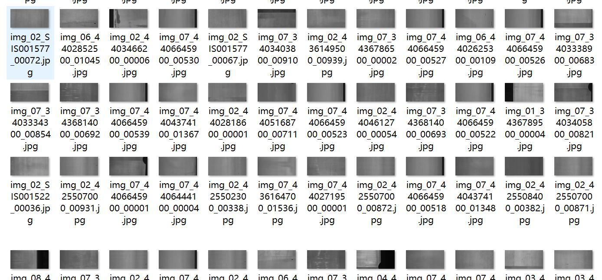
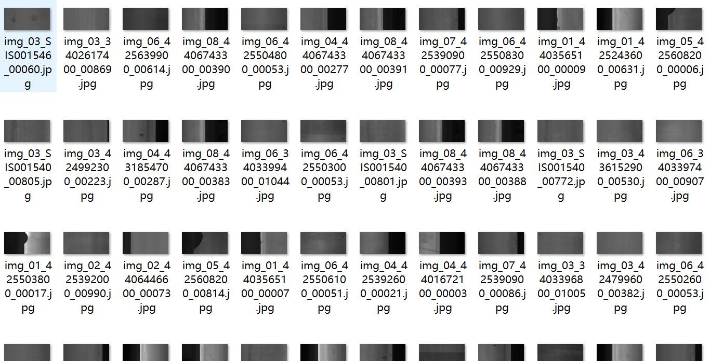
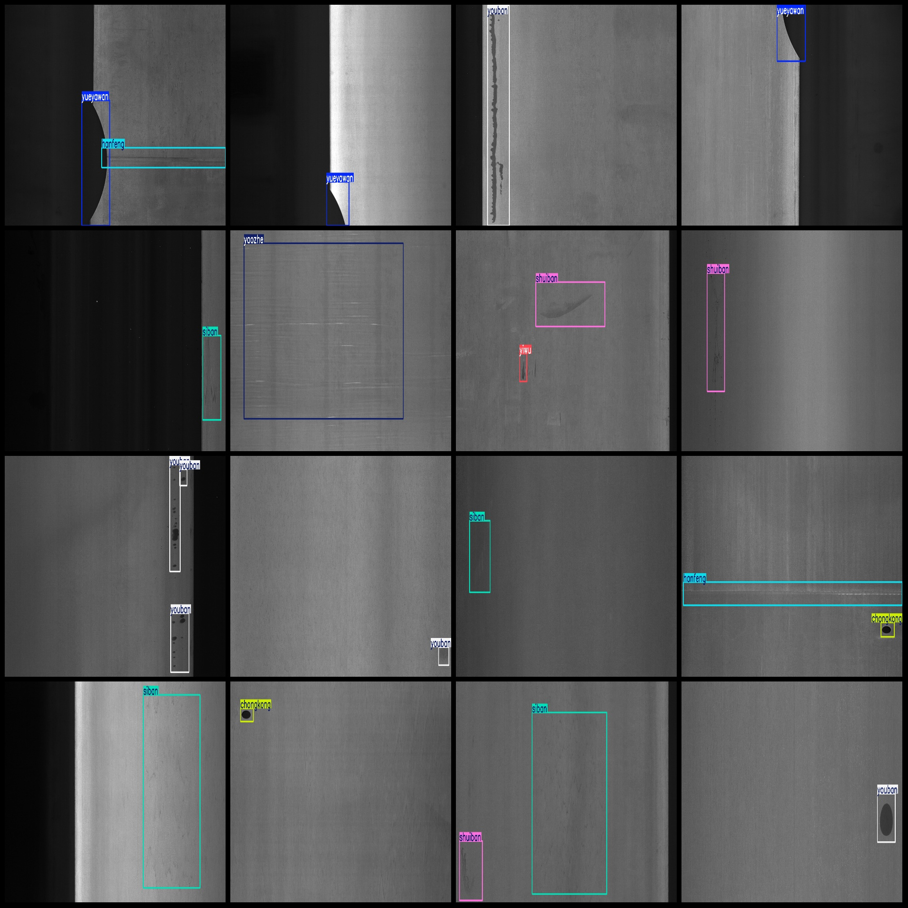
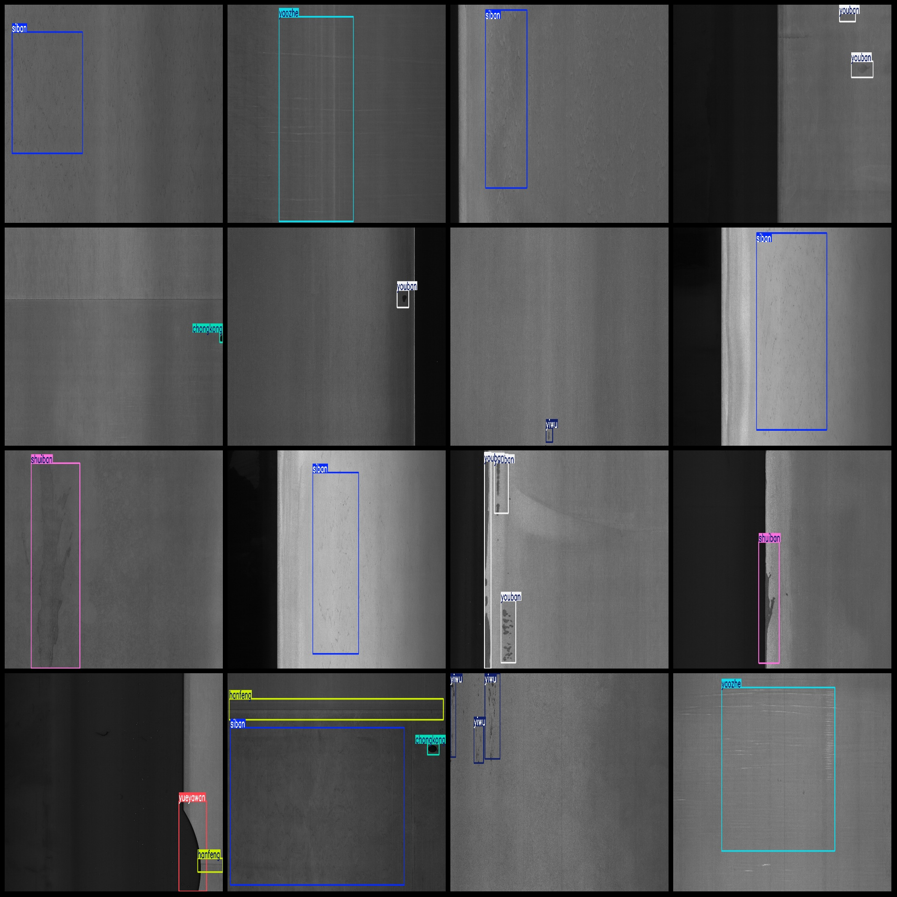

# GC10-DET Steel Defect Detection Dataset VOC+YOLO Format with 2283 Images and 10 Classifications

dataset format: Pascal VOC format+YOLO format
number of images: 2283  
annotation count: 2283  
annotation count: 2283  
annotationnumber of classes: 10  
Annotation class names: ["chongkong", "hanfeng", "shuiban", "siban", "yahen", "yaozhe", "yiwu", "youban", "yueyawan", "zhehen"]
boxes per class:   
chongkong box count = 329
hanfeng box count = 513
shuiban box count = 354
siban box count = 884
yahen box count = 85
yaozhe box count = 131
yiwu box count = 347
youban box count = 569
yueyawan box count = 265
zhehen box count = 74
total boxes: 3551  
image resolution: 2048x1000  
Using the annotation tool: labelImg.
Annotation rules: To draw a rectangle around the class.
Important notes: There are no special statements.
Special statement: This dataset does not guarantee the accuracy of the trained model or weight file.
Image preview:
## Images

Here is a pay link on Stripe ( https://buy.stripe.com/3cs8yP7sY87d0vu9AB ). Please contact me lonlonago@foxmail.com after funding $89, and I will send you a complete data files , thank you!

